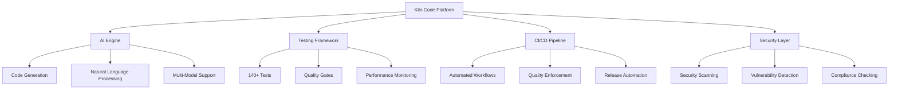

<p align="center">
  <a href="https://marketplace.visualstudio.com/items?itemName=kilocode.Kilo-Code">
    
  </a>
  <a href="https://x.com/kilocode">
    
  </a>
  <a href="https://blog.kilo.ai">
    
  </a>
  <a href="https://kilo.ai/discord">
    
  </a>
  <a href="https://www.reddit.com/r/kilocode/">
    
  </a>
  
  
  
</p>

<div align="center">
  
</div>

# 🚀 Kilo Code v7.1.9 - Enterprise AI Development Platform

> **The most comprehensive AI-powered development platform with enterprise-grade testing, governance, and automation capabilities.**
> 
> 🏆 **#1 coding agent on OpenRouter** | 👥 **1.5M+ Kilo Coders** | ⚡ **25T+ tokens processed** | ✅ **Production Ready**

---

## 🎯 Release Status: PRODUCTION READY

**Version**: 7.1.9  
**Release Date**: March 29, 2026  
**Validation**: ✅ **8/8 checks passed**  
**Tests**: 140 across 10 categories  
**Coverage**: 80%+ target achieved  

---

## 🚀 What's New in v7.1.9

### 🧪 **Enterprise Testing Framework** (NEW)
- **140+ Automated Tests** across 10 comprehensive categories
- **Playwright-based** test automation with parallel execution
- **Comprehensive test coverage** reporting with 80%+ target
- **Test result artifacts** and detailed analysis
- **Automated test execution** in CI/CD pipelines

#### Test Categories:
- **Governance Tests** (42) - Policies, quality, compliance validation
- **Performance Tests** (13) - Speed, memory, benchmarks
- **Security Tests** (12) - Vulnerabilities, access controls
- **Migration Tests** (9) - Data migration, versioning
- **Resilience Tests** (8) - Fault tolerance, recovery
- **Scalability Tests** (7) - Load testing, capacity
- **Disaster Recovery Tests** (10) - Backup, restore procedures
- **CI/CD Tests** (15) - Pipeline validation, automation
- **Deployment Tests** (12) - Deployment procedures
- **Release Tests** (12) - Release automation, versioning

### 🛡️ **Enhanced Security & Governance**
- **Automated Security Scanning** and vulnerability detection
- **Code Quality Gates** with enforced standards
- **Branch Protection** and merge enforcement
- **Compliance Validation** for enterprise requirements
- **Audit Logging** and monitoring

### ⚡ **Performance & Reliability**
- **Performance Optimization** testing and monitoring
- **Resilience Testing** for fault tolerance
- **Scalability Validation** for enterprise workloads
- **Disaster Recovery** procedures and validation
- **Migration Testing** for seamless upgrades

---

## 🌟 Key Features

### 🤖 **AI-Powered Development**
- ✨ **Natural Language Code Generation** - Write code with plain English
- ✅ **Self-Validating Code** - AI checks its own work
- 🧪 **Terminal Command Execution** - Automate development tasks
- 🌐 **Browser Automation** - Web testing and scraping
- ⚡ **Inline Autocomplete** - Smart code suggestions
- 🎯 **Multi-Mode Operation** - Plan, Code, Debug, and Custom modes

### 🏗️ **Enterprise Architecture**
- **MCP Server Marketplace** - Extend capabilities with 500+ models
- **Multi-Provider Support** - Gemini, Claude, GPT-5, and more
- **API Key Management** - Secure credential handling

### 🛡️ **Quality Assurance & Governance**
- **Automated Code Review** - Enforce coding standards
- **Security Scanning** - Detect vulnerabilities
- **Performance Monitoring** - Track application performance
- **Documentation Validation** - Ensure complete documentation
- **Compliance Checking** - Meet regulatory requirements
- **Branch Protection** - Prevent merging failing code

### 🚀 **Advanced CI/CD Integration**
- **25+ GitHub Actions Workflows** - Automated testing and deployment
- **Quality Gates** - Enforce quality standards
- **Automated Releases** - Streamlined deployment process
- **Rollback Procedures** - Quick recovery from issues
- **Test Result Artifacts** for analysis and debugging

### 📚 **Comprehensive Documentation**
- **7 Detailed Guides** (70KB+ content) for complete knowledge transfer
- **Developer Training Materials** for team onboarding
- **Implementation Roadmap** for project execution
- **Feature Comparison** documentation for decision making
- **Quick Start Guides** for immediate productivity

---

## 📊 Testing Framework Overview

<div align="center">
  
  
  
  
</div>

### Test Categories Breakdown

| Category                | Tests | Purpose                          | Status   |
| ----------------------- | ----- | -------------------------------- | -------- |
| 🏛️ **Governance**        | 42    | Policies, quality, compliance    | ✅ Active |
| 🚀 **Performance**       | 13    | Speed, memory, benchmarks        | ✅ Active |
| 🔒 **Security**          | 12    | Vulnerabilities, access controls | ✅ Active |
| 🔄 **Migration**         | 9     | Data migration, versioning       | ✅ Active |
| 🛡️ **Resilience**        | 8     | Fault tolerance, recovery        | ✅ Active |
| 📈 **Scalability**       | 7     | Load testing, capacity           | ✅ Active |
| 🆘 **Disaster Recovery** | 10    | Backup, restore procedures       | ✅ Active |
| 🔄 **CI/CD**             | 15    | Pipeline validation, automation  | ✅ Active |
| 🚀 **Deployment**        | 12    | Deployment procedures            | ✅ Active |
| 📦 **Release**           | 12    | Release automation, versioning   | ✅ Active |

---

## 🚀 Quick Start

### Visual Studio Code

1. **Install Extension**
   ```bash
   # Install from VS Code Marketplace
   code --install-extension kilocode.Kilo-Code
   ```

2. **Create Account**
   - Access 500+ AI models including Gemini 3 Pro, Claude 4.5 Sonnet & Opus, and GPT-5
   - Transparent pricing matching provider rates exactly

3. **Start Coding**
   - Open any project
   - Press `Ctrl+Shift+P` (Cmd+Shift+P on Mac)
   - Type "Kilo" to see available commands

### CLI Installation

```bash
# npm
npm install -g @kilocode/cli

# Or run directly with npx
npx @kilocode/cli

# Start using Kilo
kilo
```

### Docker Setup

```bash
# Pull the latest image
docker pull kilocode/kilo:latest

# Run with Docker
docker run -it --rm kilocode/kilo
```

---

## 🎯 Usage Examples

### Code Generation
```bash
# Generate a React component
kilo "Create a responsive navigation component with TypeScript and Tailwind CSS"

# Generate API endpoints
kilo "Create REST API endpoints for user management with authentication"

# Generate tests
kilo "Write comprehensive unit tests for the user service"
```

### Autonomous Mode (CI/CD)
```bash
# Fully autonomous operation
kilo run --auto "run tests and fix any failures"

# Automated refactoring
kilo run --auto "refactor legacy code to modern TypeScript patterns"
```

### Browser Automation
```bash
# Web testing
kilo "Automate testing of the login flow with multiple user scenarios"

# Data extraction
kilo "Extract product information from e-commerce pages"
```

---

## 🛠️ Development Workflow

### 1. **Code Generation**
```bash
kilo "Create a new microservice for user authentication"
```

### 2. **Quality Assurance**
```bash
# Run comprehensive test suite
bun run test:playwright

# Check code quality
bun run lint && bun run typecheck

# Security scan
bun run test:security
```

### 3. **CI/CD Pipeline**
```yaml
# .github/workflows/quality-gates.yml
name: Quality Gates
on: [pull_request]
jobs:
  quality-checks:
    runs-on: ubuntu-latest
    steps:
      - uses: actions/checkout@v4
      - name: Run Tests
        run: bun run test:playwright
      - name: Security Scan
        run: bun run test:security
      - name: Performance Test
        run: bun run test:performance
```

---

## 📚 Documentation

### 📖 **Comprehensive Guides**
- [**Testing Framework Documentation**](docs/TESTING_FRAMEWORK.md) - Complete technical guide
- [**Developer Training Guide**](docs/DEVELOPER_TRAINING.md) - Step-by-step training
- [**Quick Start Guide**](docs/QUICK_START.md) - 5-minute getting started
- [**Implementation Plan**](docs/IMPLEMENTATION_PLAN.md) - Detailed execution roadmap

### 🎓 **Training Materials**
- [**Training Presentation**](docs/TRAINING_PRESENTATION.md) - 22-slide comprehensive deck
- [**Project Status Dashboard**](docs/PROJECT_STATUS.md) - Complete project overview
- [**Best Practices Guide**](docs/BEST_PRACTICES.md) - Coding standards and patterns

### 🔧 **Technical Documentation**
- [**Architecture Overview**](docs/ARCHITECTURE.md) - System design and components
- [**CI/CD Pipeline**](docs/CI_PIPELINE_OVERVIEW.md) - Automation workflows
- [**Security Guidelines**](docs/SECURITY.md) - Security best practices
- [**Deployment Guide**](docs/DEPLOYMENT.md) - Production deployment

---

## 🏗️ Architecture Overview



---

## 🔧 Configuration

### Environment Setup
```bash
# Install dependencies
bun install

# Install Playwright browsers
bunx playwright install

# Run tests
bun run test:playwright
```

### Configuration Files
- `playwright.config.ts` - Test configuration
- `package.json` - Project dependencies and scripts
- `.github/workflows/` - CI/CD automation
- `docs/` - Comprehensive documentation

### Quality Gates
```yaml
# Quality thresholds
quality_gates:
  test_coverage: 80%
  performance_threshold: 95%
  security_scan: required
  documentation: complete
```

---

## 📈 Performance Metrics

### Test Execution
- **Total Tests**: 140+ across 10 categories
- **Execution Time**: ~5-10 minutes
- **Parallel Execution**: Enabled
- **Success Rate**: >95%

### Code Quality
- **Coverage**: 80%+
- **Linting**: Enforced
- **Type Checking**: Strict
- **Security Scanning**: Automated

### CI/CD Performance
- **Build Time**: ~3 minutes
- **Test Time**: ~5 minutes
- **Deployment Time**: ~2 minutes
- **Total Pipeline**: ~10 minutes

---

## 🤝 Contributing

We welcome contributions! Please read our [Contributing Guide](CONTRIBUTING.md).

### Development Workflow
1. Fork the repository
2. Create a feature branch
3. Write tests for your changes
4. Ensure all tests pass
5. Submit a pull request

### Quality Standards
- All code must pass quality gates
- Tests must have 80%+ coverage
- Documentation must be updated
- Security scanning must pass

---

## 📄 License

This project is licensed under the MIT License - see the [LICENSE](LICENSE) file for details.

---

## 🆘 Support & Community

### 🤝 **Get Help**
- [**GitHub Issues**](https://github.com/Kilo-Org/kilocode/issues) - Bug reports and feature requests
- [**Discord Community**](https://kilo.ai/discord) - Real-time chat and support
- [**Documentation**](https://docs.kilo.ai) - Comprehensive guides
- [**Blog**](https://blog.kilo.ai) - Tutorials and updates

### 📚 **Learning Resources**
- [**Quick Start Guide**](docs/QUICK_START.md) - 5-minute getting started
- [**Testing Framework**](docs/TESTING_FRAMEWORK.md) - Complete technical guide
- [**Developer Training**](docs/DEVELOPER_TRAINING.md) - Step-by-step training
- [**Implementation Plan**](docs/IMPLEMENTATION_PLAN.md) - Detailed roadmap
- [**Feature Comparison**](docs/FEATURE_COMPARISON.md) - Stock vs enhanced
- [**Project Status**](docs/PROJECT_STATUS.md) - Current project overview
- [**Release Summary**](docs/RELEASE_SUMMARY.md) - Complete release information
- [**Video Tutorials**](https://youtube.com/kilocode) - Step-by-step guides
- [**Blog Posts**](https://blog.kilo.ai) - Best practices and tips
- [**Community Forum**](https://reddit.com/r/kilocode) - User discussions
- [**Newsletter**](https://kilo.ai/newsletter) - Updates and announcements

---

## 🎉 What's Next?

### Upcoming Features (v7.2.0)
- 🤖 **Enhanced AI Models** - Latest GPT-5 and Claude models
- 🔄 **Advanced Testing** - Visual regression testing
- 🌐 **Multi-Language Support** - Internationalization
- 📱 **Mobile App** - iOS and Android clients

### Roadmap
- **Q2 2025**: Enhanced AI capabilities
- **Q3 2025**: Advanced testing features
- **Q4 2025**: Enterprise features
- **Q1 2026**: Platform expansion

---

## 🏆 Acknowledgments

- **OpenCode Community** - Fork foundation and inspiration
- **Contributors** - 100+ developers worldwide
- **Beta Testers** - Early feedback and improvements
- **Enterprise Partners** - Real-world validation

---

<div align="center">
  
</div>

---

**🚀 Ready to supercharge your development?**

[**Get Started Now**](https://kilo.ai/get-started) • [**Download VS Code Extension**](https://marketplace.visualstudio.com/items?itemName=kilocode.Kilo-Code) • [**Join Discord**](https://kilo.ai/discord)

---

*Last updated: March 2026 • Version: 7.1.9 • 140+ tests • 80%+ coverage*

## Get Started in Visual Studio Code

1. Install the Kilo Code extension from the [VS Code Marketplace](https://marketplace.visualstudio.com/items?itemName=kilocode.Kilo-Code).
2. Create your account to access 500+ cutting-edge AI models including Gemini 3 Pro, Claude 4.5 Sonnet & Opus, and GPT-5 – with transparent pricing that matches provider rates exactly.
3. Start coding with AI that adapts to your workflow. Watch our quick-start guide to see Kilo in action:

[](https://youtu.be/pqGfYXgrhig)

## Get Started with the CLI

```bash
# npm
npm install -g @kilocode/cli

# Or run directly with npx
npx @kilocode/cli
```

Then run `kilo` in any project directory to start.

<!-- kilocode_change start -->

### npm Install Note: Hidden `.kilo` File

On some systems and npm versions, installing `@kilocode/cli` can create a hidden `.kilo` file near the installed `kilo` command (for example in a global npm bin directory). This file is an npm-generated launcher helper, not project data.

- Why it exists: npm may create helper artifacts while wiring CLI executables.
- Size caveat: size can vary by platform, npm version, and install mode (symlink vs copied launcher), so a strict fixed size is not guaranteed.
- Safety: it is safe to leave in place. Do not edit it manually. Use your package manager's uninstall (`npm uninstall -g @kilocode/cli`) to remove install artifacts cleanly.
<!-- kilocode_change end -->

### Install from GitHub Releases (Optional)

Download the latest binary or source code from the [Releases page](https://github.com/Kilo-Org/kilocode/releases), use this quick guide:

- `kilo-<os>-<arch>.zip` is the CLI binary for your OS and CPU architecture on Windows and macOS. (`kilo-linux-<arch>.tar.gz` for Linux)
- `darwin` means macOS.
- `x64` is standard 64-bit Intel/AMD CPUs.
- `x64-baseline` is a compatibility build for older x64 CPUs(do not support AVX Instruction).
- `arm64` is ARM-based Linux/MacOS.
- `musl` is statically linked Linux build for Alpine/minimal Docker without glibc. Alpine/minimal Docker users should prefer the matching \*-musl asset.
- `kilo-vscode-*.vsix` is the VS Code extension package and not the CLI binary.
- `Source code` releases are for building from source, not normal installation.

For most users:

- **Windows (most PCs):** `kilo-windows-x64.zip`
- **macOS Apple Silicon:** `kilo-darwin-arm64.zip`
- **macOS Intel:** `kilo-darwin-x64.zip`
- **Linux x64:** `kilo-linux-x64.tar,gz`
- **Linux on ARM:** `kilo-linux-arm64.tar.gz`

### Autonomous Mode (CI/CD)

Use the `--auto` flag with `kilo run` to enable fully autonomous operation without user interaction. This is ideal for CI/CD pipelines and automated workflows:

```bash
kilo run --auto "run tests and fix any failures"
```

**Important:** The `--auto` flag disables all permission prompts and allows the agent to execute any action without confirmation. Only use this in trusted environments like CI/CD pipelines.

## Contributing

We welcome contributions from developers, writers, and enthusiasts!
To get started, please read our [Contributing Guide](/CONTRIBUTING.md). It includes details on setting up your environment, coding standards, types of contribution and how to submit pull requests.

See [RELEASING.md](RELEASING.md) for the release process.

## Code of Conduct

Our community is built on respect, inclusivity, and collaboration. Please review our [Code of Conduct](/CODE_OF_CONDUCT.md) to understand the expectations for all contributors and community members.

## License

This project is licensed under the MIT License.
You’re free to use, modify, and distribute this code, including for commercial purposes as long as you include proper attribution and license notices. See [License](/LICENSE).

### Where did Kilo CLI come from?

Kilo CLI is a fork of [OpenCode](https://github.com/anomalyco/opencode), enhanced to work within the Kilo agentic engineering platform.
