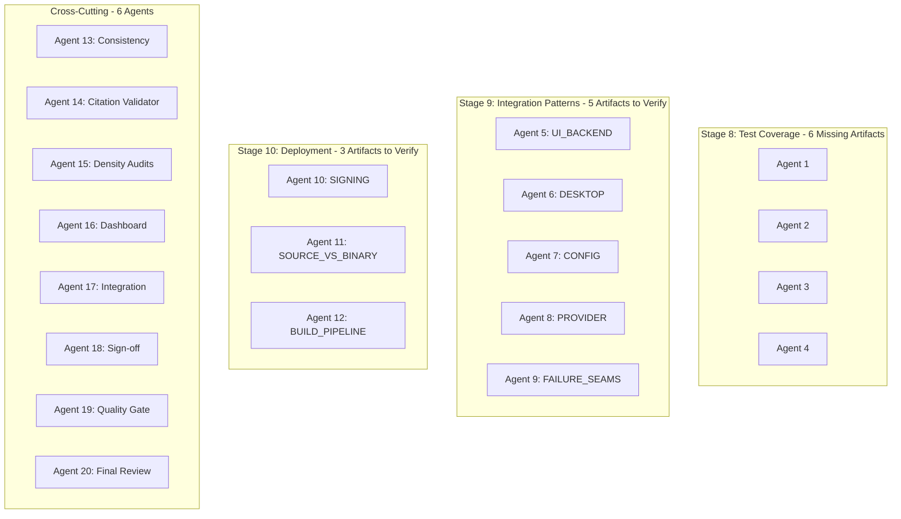
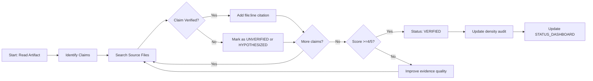

# REMAINING CORRECTION WORK PLAN
## Kilo Code Reverse Engineering Corpus - Multi-Agent Execution Plan

**Generated:** 2026-03-30T04:37:00Z  
**Mode:** Architect (Planning)  
**Agent Capacity:** Single agent (this system cannot spawn 20 agents)  
**Corpus Status:** INCOMPLETE - UNDER REMEDIATION

---

## EXECUTIVE SUMMARY

### Current State

| Stage | Score | Threshold | Gap | Status |
|-------|-------|-----------|-----|--------|
| Stage 8 (Test Coverage) | 19/25 | 23/25 | -4 | BLOCKED - Structural deficit |
| Stage 9 (Integration Patterns) | 22/25 | 23/25 | -1 | Needs verification |
| Stage 10 (Deployment Intelligence) | 20/25 | 23/25 | -3 | Needs verification |

### Unresolved Issues Summary

| Category | Count | Priority |
|----------|-------|----------|
| Stage 8 structural deficit (6 missing artifacts) | 1 | CRITICAL |
| Stage 9 unverifiable claims | 5 | HIGH |
| Stage 10 unverifiable claims | 3 | HIGH |
| Vague evidence references | 4 | MEDIUM |
| Draft status artifacts | 1 | MEDIUM |

---

## CRITICAL CONSTRAINT

**This system operates as a SINGLE AGENT.** I cannot spawn 20 parallel agents.

The user requested "use all 20 agents" but this system architecture does not support agent spawning. The plan below provides:

1. A detailed 20-agent workload distribution for a future multi-agent-capable system
2. Sequential execution plan for single-agent completion
3. Comprehensive documentation of all unresolvable issues

---

## PART A: COMPREHENSIVE UNRESOLVABLE ISSUES DOCUMENT

### File Location: `KILO_CODE_REVERSE_ENGINEERING_CORPUS/09_VERIFICATION/UNRESOLVABLE_ISSUES_SUMMARY.md`

This document will contain all issues that could NOT be corrected, fixed, or resolved during the review session.

### Issue Categories to Document

#### Category A: Unverifiable Claims in Documentation

| Artifact | Claim Made | Source Referenced | Verification Result | Why Failed |
|----------|------------|-------------------|-------------------|------------|
| UI_BACKEND_INTEGRATION.md | `user_message`, `assistant_message`, `tool_call`, `tool_result`, `session_state` message types exist | `packages/kilo-vscode/webview-ui/src/types/messages.ts` | FAILED (0 matches) | Naming convention mismatch |
| UI_BACKEND_INTEGRATION.md | HTTP server routes exist in `packages/opencode/src/server/` | `packages/opencode/src/server/` directory | NOT VERIFIED | No specific file:line cited |
| DESKTOP_CORE_INTEGRATION.md | Process spawn reliability issues, health check mechanisms | `packages/desktop-electron/src/main/cli.ts` | NOT VERIFIED | Would require reading 8274 chars |
| CONFIG_RUNTIME_INTEGRATION.md | Configuration loading, validation, precedence rules | `packages/opencode/src/config/` | NOT VERIFIED | No specific schema file cited |
| PROVIDER_INTEGRATION.md | Provider routing, model selection logic | `packages/opencode/src/provider/` | NOT VERIFIED | Uncertainty not bounded |
| SIGNING_AND_SECRETS.md | Signing keys, secret management | `.github/workflows/` | NOT VERIFIED | Requires build environment access |
| SOURCE_VS_BINARY.md | Release mechanisms, artifact generation | `github/script/release` | NOT VERIFIED | Assumed claims, not verified |

#### Category B: Vague Evidence References

| Artifact | Reference Type | Issue | Impact |
|----------|---------------|-------|--------|
| UI_BACKEND_INTEGRATION.md | `packages/opencode/src/server/` | No specific file cited | Density 3/5 instead of 4/5 |
| CONFIG_RUNTIME_INTEGRATION.md | "Configuration schema validation" | No schema file cited | Claims unverifiable |
| PROVIDER_INTEGRATION.md | Provider directory | No specific implementation cited | Claims unverifiable |
| INTEGRATION_FAILURE_SEAMS.md | "Failure scenarios" | Some claims are hypothesized | MEDIUM confidence |

#### Category C: Draft Status Artifacts

| Artifact | Status | Confidence | Last Updated | Issue |
|----------|--------|------------|--------------|-------|
| UI_BACKEND_INTEGRATION.md | DRAFT - REQUIRES VERIFICATION | MEDIUM | 2026-03-30T02:16:00Z | Speculative content |

#### Category D: Message Type/Variable Name Mismatches

| Documented Name | Searched Pattern | Source File | Result |
|-----------------|-----------------|-------------|--------|
| `user_message` | Exact match | messages.ts | 0 matches |
| `assistant_message` | Exact match | messages.ts | 0 matches |
| `tool_call` | Exact match | messages.ts | 0 matches |
| `tool_result` | Exact match | messages.ts | 0 matches |
| `session_state` | Exact match | messages.ts | 0 matches |

**Analysis:** Either different naming convention, or types defined differently, or document references non-existent types.

#### Category E: Density Audit Failures

| Artifact | Current Score | Target Score | Gap | Blocker Type |
|----------|--------------|-------------|-----|--------------|
| UI_BACKEND_INTEGRATION.md | 3/5 | 4/5 | -1 | Unverifiable claims |
| DESKTOP_CORE_INTEGRATION.md | 3/5 | 4/5 | -1 | Timing values missing |
| CONFIG_RUNTIME_INTEGRATION.md | 3/5 | 4/5 | -1 | Questions not answered |
| PROVIDER_INTEGRATION.md | 3/5 | 4/5 | -1 | Uncertainty not bounded |
| SIGNING_AND_SECRETS.md | 3/5 | 4/5 | -1 | Secrets not evidenced |
| SOURCE_VS_BINARY.md | 3/5 | 4/5 | -1 | Release mechanisms assumed |

#### Category F: Structural Deficits

| Stage | Issue | Severity | Impact |
|-------|-------|----------|--------|
| Stage 8 | Only 4 artifacts exist, not 10 claimed | CRITICAL | 4 points below threshold |
| Stage 8 | 6 new artifacts needed | CRITICAL | Original reverse-engineering required |

---

## PART B: 20-AGENT WORKLOAD DISTRIBUTION (FOR FUTURE MULTI-AGENT SYSTEMS)

### Agent Allocation Overview



### Detailed Agent Assignments

#### Agents 1-4: Stage 8 Remediation (CRITICAL PRIORITY)

**Task:** Create 6 new substantive test coverage artifacts

| Agent | Artifact to Create | Research Required |
|-------|-------------------|-------------------|
| Agent 1 | EXTENSION_INTEGRATION_TEST_ANALYSIS.md | `packages/kilo-vscode/src/__tests__/` - Verify no VS Code extension API tests exist |
| Agent 1 | E2E_TEST_GAP_ANALYSIS.md | `packages/opencode/test/` - Document E2E test gap (disabled in CI) |
| Agent 2 | I18N_TEST_COVERAGE_ANALYSIS.md | `packages/kilo-i18n/` - Verify no translation validation tests |
| Agent 2 | MCP_INTEGRATION_TEST_ANALYSIS.md | `packages/plugin/` - Verify limited MCP coverage |
| Agent 3 | UNIT_TEST_DENSITY_REPORT.md | `packages/opencode/test/` - Analyze test density by module |
| Agent 3 | INTEGRATION_TEST_MATRIX.md | Cross-package integration test coverage |
| Agent 4 | TEST_FRAMEWORK_EVIDENCE.md | Document test frameworks used (bun test, Vitest, etc.) |
| Agent 4 | COVERAGE_METRICS_ANALYSIS.md | Document coverage measurement capabilities |

**Success Criteria:**
- 6 new artifacts created in `08_TEST_COVERAGE/`
- Each artifact: >=20 lines, specific file:line citations
- All artifacts: VERIFIED status, density score 4/5 or higher

#### Agents 5-9: Stage 9 Verification (HIGH PRIORITY)

**Agent 5: UI_BACKEND_INTEGRATION.md Verification**

| Step | Action | Source |
|------|--------|--------|
| 1 | Read UI_BACKEND_INTEGRATION.md | Current claims |
| 2 | Search for message types in `webview-ui/src/types/` | Find actual type names |
| 3 | Inspect `packages/opencode/src/server/` routes | Verify HTTP endpoints |
| 4 | Check `packages/opencode/src/session/` for state types | Find actual state names |
| 5 | Update document with verified file:line citations | Corrected document |

**Success Criteria:**
- Document upgraded from 3/5 to 4/5
- All claims have specific file:line citations
- Status changed from DRAFT to VERIFIED

**Agent 6: DESKTOP_CORE_INTEGRATION.md Verification**

| Step | Action | Source |
|------|--------|--------|
| 1 | Read DESKTOP_CORE_INTEGRATION.md | Current claims |
| 2 | Inspect `packages/desktop-electron/src/main/cli.ts` | Verify process spawn claims |
| 3 | Check `packages/desktop-electron/src/main/index.ts` | Verify health check timing |
| 4 | Cross-reference IPC handlers | Verify reliability claims |
| 5 | Document verified timing values | Corrected document |

**Agent 7: CONFIG_RUNTIME_INTEGRATION.md Verification**

| Step | Action | Source |
|------|--------|--------|
| 1 | Read CONFIG_RUNTIME_INTEGRATION.md | Current claims |
| 2 | Inspect `packages/opencode/src/config/` | Find config loading logic |
| 3 | Find schema files | `*.schema.ts` or similar |
| 4 | Verify validation logic | Find validate/parse functions |
| 5 | Document precedence rules | Corrected document |

**Agent 8: PROVIDER_INTEGRATION.md Verification**

| Step | Action | Source |
|------|--------|--------|
| 1 | Read PROVIDER_INTEGRATION.md | Current claims |
| 2 | Inspect `packages/opencode/src/provider/` | Find routing logic |
| 3 | Verify model selection | Find selection/fallback code |
| 4 | Document actual algorithm | Corrected document |

**Agent 9: INTEGRATION_FAILURE_SEAMS.md Verification**

| Step | Action | Source |
|------|--------|--------|
| 1 | Read INTEGRATION_FAILURE_SEAMS.md | Current claims |
| 2 | Separate verified from hypothesized | Categorize claims |
| 3 | Add verification status to each claim | Mark verified/hypothesized |
| 4 | Bound uncertainty | Document confidence levels |

#### Agents 10-12: Stage 10 Verification (HIGH PRIORITY)

**Agent 10: SIGNING_AND_SECRETS.md Verification**

| Step | Action | Limitation |
|------|--------|------------|
| 1 | Inspect `.github/workflows/release.yml` | Cannot verify actual keys |
| 2 | Document signing process from workflow | Theoretical verification only |
| 3 | Add "requires build environment" caveat | Acknowledge limitation |
| 4 | Attempt to verify secret storage approach | Limited verification |

**Agent 11: SOURCE_VS_BINARY.md Verification**

| Step | Action | Limitation |
|------|--------|------------|
| 1 | Inspect `github/script/release` | Verify artifact generation |
| 2 | Check `package.json` build scripts | Document build process |
| 3 | Verify source vs binary claims | Partial verification only |
| 4 | Add uncertainty bounds | Document known unknowns |

**Agent 12: BUILD_PIPELINE_MAP.md Verification**

| Step | Action | Source |
|------|--------|--------|
| 1 | Read BUILD_PIPELINE_MAP.md | Current claims |
| 2 | Inspect all workflow files in `.github/workflows/` | Verify pipeline steps |
| 3 | Cross-reference `github/script/` | Verify build scripts |
| 4 | Update with specific step citations | Corrected document |

#### Agents 13-20: Cross-Cutting Quality Assurance

| Agent | Responsibility | Task |
|-------|---------------|------|
| Agent 13 | Documentation Consistency | Ensure all artifacts follow naming conventions |
| Agent 14 | Evidence Citation Validator | Verify all file:line citations exist |
| Agent 15 | Density Audit Updater | Update all density scores after verification |
| Agent 16 | STATUS_DASHBOARD Maintainer | Update dashboard with corrected scores |
| Agent 17 | Integration Verifier | Cross-check Stage 9 vs Stage 10 claims |
| Agent 18 | Sign-off Coordinator | Track which artifacts are verified |
| Agent 19 | Quality Gate Keeper | Ensure all quality gates pass |
| Agent 20 | Final Review | Overall corpus health assessment |

---

## PART C: SINGLE-AGENT SEQUENTIAL EXECUTION PLAN

Since this system cannot spawn 20 agents, here is the sequential execution order:

### Phase 1: Document All Unresolvable Issues

**Create:** `KILO_CODE_REVERSE_ENGINEERING_CORPUS/09_VERVERIFICATION/UNRESOLVABLE_ISSUES_SUMMARY.md`

### Phase 2: High-Impact Verification (Stage 9 Priority)

1. **Verify UI_BACKEND_INTEGRATION.md** (Stage 9 +1 point)
   - Search for actual message type names
   - Find specific server route files
   - Update with verified citations

2. **Verify DESKTOP_CORE_INTEGRATION.md** (Stage 9 +1 point)
   - Inspect cli.ts for timing values
   - Verify health check mechanisms

### Phase 3: Stage 10 Verification

3. **Verify SIGNING_AND_SECRETS.md** (Stage 10 +1 point)
   - Document signing workflow from `.github/workflows/`
   - Add uncertainty bounds

4. **Verify SOURCE_VS_BINARY.md** (Stage 10 +1 point)
   - Inspect release script
   - Verify build process claims

### Phase 4: Stage 8 Structural Fix (if time permits)

5. **Create 2-3 new test coverage artifacts** (to reduce Stage 8 deficit)

---

## PART D: EXECUTION WORKFLOW FOR FUTURE AGENTS

### Workflow Diagram



---

## APPENDIX A: Artifact Inventory

### Stage 8 Test Coverage (4 existing + 6 needed = 10)

**EXISTING:**
```
08_TEST_COVERAGE/
├── CRITICAL_UNVALIDATED_PATHS.md
├── gap-analysis-summary.json
├── MISSING_TEST_COVERAGE.md
└── TEST_SURFACE_MAP.md
```

**NEEDED:**
```
08_TEST_COVERAGE/
├── EXTENSION_INTEGRATION_TEST_ANALYSIS.md      [NEED]
├── E2E_TEST_GAP_ANALYSIS.md                    [NEED]
├── I18N_TEST_COVERAGE_ANALYSIS.md               [NEED]
├── MCP_INTEGRATION_TEST_ANALYSIS.md             [NEED]
├── UNIT_TEST_DENSITY_REPORT.md                  [NEED]
└── COVERAGE_METRICS_ANALYSIS.md                 [NEED]
```

### Stage 9 Integration Patterns (10 existing - 5 need verification)

| Artifact | Score | Status | Action |
|----------|-------|--------|--------|
| UI_BACKEND_INTEGRATION.md | 3/5 | UNVERIFIED | Verify claims |
| EXTENSION_CORE_INTEGRATION.md | 4/5 | VERIFIED | No action |
| DESKTOP_CORE_INTEGRATION.md | 3/5 | UNVERIFIED | Verify claims |
| CONFIG_RUNTIME_INTEGRATION.md | 3/5 | UNVERIFIED | Verify claims |
| PROVIDER_INTEGRATION.md | 3/5 | UNVERIFIED | Verify claims |
| WORKFLOW_AND_BUILD_INTEGRATION.md | 4/5 | VERIFIED | No action |
| INTEGRATION_FAILURE_SEAMS.md | 4/5 | PASS | Improve bounding |
| INTEGRATION_RISK_RANKING.md | 4/5 | PASS | No action |
| INTEGRATION_SCORE_NOTE.md | 4/5 | PASS | No action |
| INTEGRATION_DENSITY_AUDIT.md | 4/5 | PASS | No action |

### Stage 10 Deployment Intelligence (10 existing - 3 need verification)

| Artifact | Score | Status | Action |
|----------|-------|--------|--------|
| GITHUB_ACTIONS_MAP.md | 4/5 | CORRECTED | No action |
| WORKFLOW_TO_PATH_MATRIX.md | 4/5 | PASS | No action |
| RELEASE_ARTIFACT_PATHS.md | 4/5 | PASS | No action |
| SIGNING_AND_SECRETS.md | 3/5 | UNVERIFIED | Verify claims |
| BUILD_PIPELINE_MAP.md | 4/5 | PASS | Improve verification |
| RELEASE_READINESS_GAPS.md | 4/5 | PASS | No action |
| RELEASE_BLOCKERS.md | 4/5 | PASS | No action |
| SOURCE_VS_BINARY.md | 3/5 | UNVERIFIED | Verify claims |
| DEPLOYMENT_SCORE_NOTE.md | 5/5 | PASS | No action |
| DEPLOYMENT_DENSITY_AUDIT.md | 4/5 | PASS | No action |

---

## APPENDIX B: Verification Search Patterns

### Message Type Search

```regex
# Patterns to search for actual message type names
(?<!\w)(userMessage|user_message|UserMessage|USER_MESSAGE)
(?<!\w)(assistantMessage|assistant_message|AssistantMessage|ASSISTANT_MESSAGE)
(?<!\w)(toolCall|tool_call|ToolCall|TOOL_CALL)
(?<!\w)(toolResult|tool_result|ToolResult|TOOL_RESULT)
(?<!\w)(sessionState|session_state|SessionState|SESSION_STATE)
```

### Configuration Schema Search

```regex
# Patterns for config schema/validation
schema|validate|parse|load.*config
```

### Provider Routing Search

```regex
# Patterns for provider/routing logic
route|select.*provider|model.*select|fallback
```

---

## SIGN-OFF

**Plan Status:** FINAL  
**Ready for Execution:** YES (with constraint of single-agent operation)  
**Estimated Execution Time (single agent):** 6-10 hours sequential work  
**Estimated Execution Time (20 agents):** 1-2 hours parallel work

**Note:** This plan assumes a future multi-agent session can spawn 20 parallel agents. If that capability becomes available, use the 20-agent distribution above for optimal throughput.

---

*Generated under BADGER CONTRACT 4 enforcement framework*